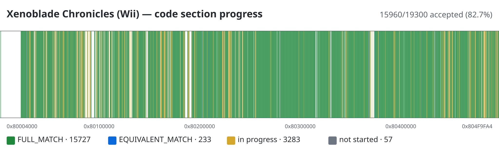

# Xenoblade Chronicles (Wii) — Decompilation

Byte-matching decompilation of *Xenoblade Chronicles* for the Nintendo Wii
(`main.dol` + RELs). The goal is to reconstruct the game as **high-level C/C++**
that compiles with the original MWCC toolchain into object files matching the
retail binary — instruction for instruction where possible, and with proven
semantic equivalence when 100% static match is unreachable.

The workflow is registry-driven: every function in the binary is a tracked
target with an owner, a match state, and an acceptance bar, and a single runner
CLI drives configure/build/diff/acceptance/size/symbol-recovery.

This is a **fork** of [xbret/xenoblade](https://github.com/xbret/xenoblade).

| | |
|---|---|
| **Upstream** | [xbret/xenoblade](https://github.com/xbret/xenoblade) |
| **Agent workflow** | [`AGENTS.md`](AGENTS.md) → [`xenoblade-decomp` skill](.agents/skills/xenoblade-decomp/SKILL.md) |
| **Architecture** | [`PLAN.md`](PLAN.md) |
| **Implementation map** | [`COOP_IMPLEMENTATION_MAP.md`](COOP_IMPLEMENTATION_MAP.md) |

This repo does **not** ship game assets or retail assembly. You need a legally
obtained copy of the game to extract them yourself.

### Region hashes (`main.dol`)

| Region | SHA1 |
|:------:|------|
| JP | `a564033aee46988743d8f5e6fdc50a8c65791160` |
| EU | `10d34dbf901e5d6547718176303a6073ee80dda2` |
| US | `214b15173fa3bad23a067476d58d3933ad7037b7` |

The runner defaults to **US**. Use another region via `coop.json` or
`configure.py --version`.

---

## Project status



Each column of the map is one slice of the retail code section (addresses
`0x80004000`–`0x804F9FA4`), colored by the best match state among the functions
at that address: green `FULL_MATCH`, blue `EQUIVALENT_MATCH`, amber in
progress, light gray not started.

Generated from the target registry (`tools/coop/targets.json`) — do not edit by
hand. Regenerate with:

```sh
.venv/bin/python3 tools/coop/progress_map.py                     # rewrite assets/progress-map.svg
.venv/bin/python3 tools/coop/readme_status.py --write            # refresh the table below
.venv/bin/python3 tools/coop/readme_status.py --check            # CI: fail if stale
```

A `pre-commit` hook can do this automatically on every commit — it regenerates
the map, the status table, and the equivalence blocks, then stages them so the
commit carries fresh numbers:

```sh
bash .githooks/install.sh    # one-time: symlink into .git/hooks/
# skip a single refresh with: git commit --no-verify
```

<!-- BEGIN GENERATED COOP STATUS -->

Region: `us` · acceptance bar: `EQUIVALENT_MATCH` or `FULL_MATCH` (policy `equivalent`)

| Metric | Count |
|---|---|
| Targets (registry) | 19300 |
| Buildable | 19300 |
| Accepted | 10119 (`FULL_MATCH` 9872 · `EQUIVALENT_MATCH` 247) |
| Active (in progress) | 3227 |

<!-- END GENERATED COOP STATUS -->

---

## Matching policy

- **Acceptance bar** — every tracked target must reach **`EQUIVALENT_MATCH`**
  (static fuzzy ≥ 50% **and** a semantic-equivalence proof under the default
  effect-aware contract, **and** split-size fit) or **`FULL_MATCH`** (100%
  static + relocs, **and** split-size fit). Both are equal-tier acceptance
  outcomes; prefer `FULL_MATCH` when reachable — it is cheaper to certify and
  is stronger evidence.
- **Source language** — reconstruction is **high-level C/C++ only** in `src/**`
  and `libs/**`: fields, locals, control flow, and normal function calls. No
  asm / register / stack micro-matching (narrow documented exceptions only,
  see `PLAN.md` §17.6).
- **Size** — a decompiled translation unit's `.text` must fit its retail slice
  in `config/<region>/splits.txt`, or the object cannot link at the retail
  address. Size overflow blocks acceptance.
- **Assets** — never commit `orig/`, `main.dol`, RELs, or disc assets.

---

## Quick start

All commands use the project venv (`.venv/bin/python3`), never the system
`python3` — the tools require a modern Python.

### 1. Dependencies

**macOS**

```sh
brew install ninja
brew install --cask --no-quarantine gcenx/wine/wine-crossover
# After OS upgrades, if Wine is quarantined:
# sudo xattr -rd com.apple.quarantine '/Applications/Wine Crossover.app'
```

**Linux** — install ninja. On x86(_64), [wibo](https://github.com/decompals/wibo)
is fetched automatically; other arches need wine.

**Windows** — Python and [ninja](https://github.com/ninja-build/ninja/releases)
on `%PATH%`. Prefer native tooling (WSL breaks objdiff file watching).

Also useful: [objdiff](https://github.com/encounter/objdiff) for visual diffing,
[Dolphin](https://dolphin-emu.org/) for PPC behaviour tests and gameplay.

### 2. Extract the game

With Dolphin, extract to `orig/<region>` (e.g. `orig/us`). Only these are
required:

- `sys/main.dol`
- `files/rels/*.rel`


### 3. Configure the runner

```sh
cp tools/coop/coop.example.json coop.json
# Optional: set "dolphin" to your Dolphin binary for PPC tests
.venv/bin/python3 tools/coop/run.py status
.venv/bin/python3 tools/coop/run.py baseline   # sha1 + configure + ninja
```

Equivalent without the runner:

```sh
.venv/bin/python3 configure.py --version us --map
ninja
```

---

## Everyday workflow

### Pick and claim a target

```sh
.venv/bin/python3 tools/coop/run.py targets list
.venv/bin/python3 tools/coop/run.py targets show <target-id>    # identity + state
.venv/bin/python3 tools/coop/run.py targets claim <target-id> --owner <agent>
.venv/bin/python3 tools/coop/run.py targets claim-smallest --owner <agent>
.venv/bin/python3 tools/coop/run.py targets release <target-id> --owner <agent>
```

`targets.json` is the sole source of truth for function identity, owners, and
match state — do not hand-maintain checklists.

### Iterate with `hexdiff` (the fast feedback loop)

`hexdiff` builds the object and diffs it against retail in ~1s, with a
one-line verdict (`84.7% | 0 structural | 20 reg_swap | PASS`), reg-swap vs
structural breakdown, a register-mapping table, compiler-config line, and
knowledge-base hints. Use it during iteration; run `cycle` only for final
acceptance.

```sh
.venv/bin/python3 tools/coop/hexdiff.py <unit> --all                       # unit triage
.venv/bin/python3 tools/coop/hexdiff.py <unit> --symbol <mangled>          # one function
.venv/bin/python3 tools/coop/hexdiff.py <unit> --symbol <mangled> --brief  # verdict + mismatches
.venv/bin/python3 tools/coop/hexdiff.py <unit> --list [substr]             # find symbols
.venv/bin/python3 tools/coop/hexdiff.py <unit> --symbol <mangled> --asm    # clean disasm
```

`<unit>` accepts an objdiff unit hint (`kyoshin/COccCulling`) or a source path.
Before editing, search the MWCC knowledge base for the function and its
mismatch patterns:

```sh
.venv/bin/python3 tools/mwcc_kb.py search "<function or symbol>" --json
.venv/bin/python3 tools/mwcc_kb.py search "<mismatch terms>" --kind reference --json
```

### Accept a target

```sh
.venv/bin/python3 tools/coop/run.py cycle <target-id> \
  --hypothesis "..." --next-change "..." --runtime-test ""

# If fuzzy is in [50, 100) and the cheap witness did not certify, run the
# full SMT probe once at acceptance time:
.venv/bin/python3 tools/coop/run.py cycle <target-id> --smt
```

`cycle` runs the cheap register-renaming witness by default; the Z3 probe
(`--smt`) costs 15–30 min of machine time, so run it **once, at acceptance**,
not during iteration. If the function is stuck around 90%+, use
`run.py diff <unit> --symbol <sym>` (full probe) as the divergence oracle
before rewriting. `FULL_MATCH` targets are certified automatically without
`--smt`.

Mass-accept a whole unit or milestone:

```sh
.venv/bin/python3 tools/coop/batch-cycle.py us-80345678 us-80345680 \
  --default-hypothesis "high-level C reconstruction complete" \
  --default-next-change "verify static match and equivalence" --summary sum.json
```

### Size budget (required before acceptance)

```sh
.venv/bin/python3 tools/coop/run.py size <unit>     # .text vs split budget
.venv/bin/python3 tools/coop/run.py size --all
```

`diff`, `cycle`, and `behaviour compare` print a `size:` line and exit
non-zero when the decomp `.text` exceeds the retail split.

### Symbol recovery

After acceptance (or when investigating `UnkClass_*` / `func_*` placeholders):

```sh
.venv/bin/python3 tools/coop/run.py symbols list --kind UnkClass
.venv/bin/python3 tools/coop/run.py symbols show 8043C59C
.venv/bin/python3 tools/coop/run.py symbols xref 8043C59C
.venv/bin/python3 tools/coop/run.py symbols rename-plan UnkClass_8043C59C CViewRectData --verbose
.venv/bin/python3 tools/coop/run.py symbols rename-all UnkClass_8043C59C CViewRectData --dry-run
```

`rename-all` updates symbol maps, source, `configure.py`, `splits.txt`, and
renames `UnkClass_*.cpp/.hpp` files on disk. Prefer same-length renames to
avoid re-mangling every symbol.

### Behaviour and PPC evidence (optional)

```sh
.venv/bin/python3 tools/coop/run.py behaviour audit      # size budget for registered tests
.venv/bin/python3 tools/coop/run.py behaviour compare <test-id>
.venv/bin/python3 tools/coop/run.py behaviour ppc <test-id>    # headless Dolphin
.venv/bin/python3 tools/coop/run.py equivalence check-unit <unit> --symbol <token>
```

Equivalence applies only to its printed observables; unsupported instructions,
timeouts, and solver `unknown` are inconclusive. This evidence feeds
`EQUIVALENT_MATCH` — it does not replace split-size checks.

### Reloc drift (#1 cause of 99%+ near-misses)

Bytes identical but relocation **sites** differ — **name** drift (same site, different symbol), **presence** drift (reloc on one side only), **type** drift (same offset, different reloc class), plus addend/layout/structural. `reloc_map.py` detects the drift per function and suggests the approved source fix (an
`extern "C" lbl_eu_*` declaration for name drift; inline/emit-the-symbol guidance for presence drift; builtin/expression guidance for type drift):

```sh
.venv/bin/python3 tools/coop/reloc_map.py diff <unit> --symbol <mangled-sym> --no-build
.venv/bin/python3 tools/coop/reloc_map.py mine        # rebuild the repo-wide map
```

| Subsystem | Entry |
|-----------|--------|
| Runner CLI | `.venv/bin/python3 tools/coop/run.py --help` |
| Full workflow + acceptance protocol | [`.agents/skills/xenoblade-decomp/SKILL.md`](.agents/skills/xenoblade-decomp/SKILL.md) |
| Behaviour + PPC | [`tools/test/compare_behaviour/README.md`](tools/test/compare_behaviour/README.md) |
| PPC equivalence | [`tools/ppc_equivalence/README.md`](tools/ppc_equivalence/README.md) |
| MWCC patterns | [`docs/MWCC_REFERENCE.md`](docs/MWCC_REFERENCE.md) |
| Attempt log | [`docs/evidence/decomp/attempts.jsonl`](docs/evidence/decomp/attempts.jsonl) |

---

## Diffing (objdiff)

After a successful build, root `objdiff.json` is ready. Open the project in
[objdiff](https://github.com/encounter/objdiff), set **Project directory**, and
select an object. Rebuilds track source, headers, `configure.py`, `splits.txt`,
and `symbols.txt`.


This project's runner config passes `functionRelocDiffs=data_value` (see
`coop.json`). Manual diffs:

```sh
.venv/bin/python3 tools/coop/run.py diff <unit> --symbol <mangled>
```

---

## Editor / agent setup

- **VS Code / Cursor:** ready-made settings live in `.vscode`.
- **Agents:** follow [`AGENTS.md`](AGENTS.md). The `xenoblade-decomp` skill and
  `.cursor/rules/xenoblade-decomp.mdc` apply automatically in this repo.

---

## Documentation map

| Document | Contents |
|----------|----------|
| [`AGENTS.md`](AGENTS.md) | Entry point: reading order, quick commands, do-not list |
| [`PLAN.md`](PLAN.md) | Architecture invariants, matching policy, decomp loop (§17) |
| [`COOP_IMPLEMENTATION_MAP.md`](COOP_IMPLEMENTATION_MAP.md) | Capability graph and handoffs |
| [`docs/MWCC_REFERENCE.md`](docs/MWCC_REFERENCE.md) | Compiler behaviour, proven patterns, pitfalls — append breakthroughs here |
| [`docs/MWCC_KNOWLEDGE_BASE.md`](docs/MWCC_KNOWLEDGE_BASE.md) | Search protocol for `mwcc_kb.py` |
| [`docs/coding_style_guidelines.md`](docs/coding_style_guidelines.md) | Style for shared decomp code |
| [`tools/coop/targets.json`](tools/coop/targets.json) | Canonical function registry and current state |

---

<!-- BEGIN GENERATED PPC_EQUIVALENCE_VERSION -->

- Architecture model: `broadway-ppc32-be-v51`
- Result format: `24`
- Certificate format: `20`

<!-- END GENERATED PPC_EQUIVALENCE_VERSION -->
<!-- BEGIN GENERATED PROOF_STATUS_TABLE -->

| Status | Value |
|---|---|
| `EQUIVALENT` | `equivalent` |
| `NOT_EQUIVALENT` | `not_equivalent` |
| `INCONCLUSIVE_TIMEOUT` | `inconclusive_timeout` |
| `INCONCLUSIVE_UNKNOWN` | `inconclusive_unknown` |
| `INCONCLUSIVE_UNSUPPORTED` | `inconclusive_unsupported` |
| `INCONCLUSIVE_ABSTRACTION` | `inconclusive_abstraction` |
| `INCONCLUSIVE_LAYOUT` | `inconclusive_layout` |
| `INCONCLUSIVE_UNVALIDATED_CALLEE` | `inconclusive_unvalidated_callee` |
| `INCONCLUSIVE_UNMODELED_EXCEPTION` | `inconclusive_unmodeled_exception` |
| `INCONCLUSIVE_SMT_DISABLED` | `inconclusive_smt_disabled` |
| `INVALID_INPUT` | `invalid_input` |
| `INTERNAL_ERROR` | `internal_error` |

<!-- END GENERATED PROOF_STATUS_TABLE -->
