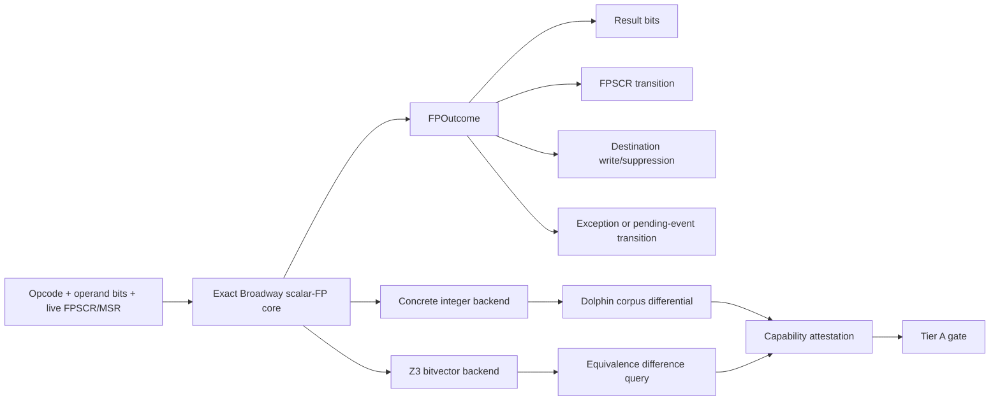

# Scalar FP architecture-model release (v2)

> **Status:** approved architecture direction — **not** an incremental relaxation
> of the current FP Tier A gate.
>
> **Supersedes (as the promotion bar):** foundations-only
> `fp-scalar-oracle-v1` / RNE SoftFloat oracle path for Tier A scalar FP.
> Current production models (`broadway-fp-*-v1` / `broadway-fp-scalar-v2`)
> remain in force until Phase 12.

## Implementation progress

**Honest summary:** Experimental exact-v2 path is wired end-to-end for scalar
families (ConcreteOps + SymbolicOps arith/fused) behind
`SCALAR_FP_EXACT_V2=0` (default off). **Final Tier A definition of done is NOT
met.** Production still uses `broadway-fp-*-v1` / `broadway-fp-scalar-v2`.
Remaining: live Dolphin attestation for NI=1/non-RNE (exact-kernel supplements
exist), symbolic fdiv/fused payloads, production switch /
`ARCHITECTURE_MODEL` bump, and residual cert debt (~7 queued).

| Phase | Focus | Status |
|---|---|---|
| 0 | Reproducible baseline | **Mostly done** — unit blockers + fixture link fixed; Dolphin fixtures 73/0; cert queue reduced (~5 missing still blocked on callees/`replace` was fixed) |
| 1 | Architectural contract | **DONE** — `scalar_fp_contract_v2.yaml` + experimental models + `SCALAR_FP_EXACT_V2` |
| 2 | Exact rounding kernel | **DONE** — `fp_bits` / `fp_round` / `fp_backend` (4 RN) |
| 3 | Non-fused arithmetic | **DONE (experimental)** — `fp_exact.py` + semantics for both backends |
| 4 | FPSCR transitions | **DONE (experimental)** — `apply_fpscr_transition` shared path |
| 5 | NI behavior | **DONE (experimental)** — live FPSCR NI + expanded ops |
| 6 | Remaining scalar families | **DONE (experimental)** — compare/convert/estimate/loadstore wired in semantics |
| 7 | Symbolic backend | **Advanced** — payload-accurate symbolic fadd/fmul/fsub via `fp_exact_symbolic_arith.py`; fdiv/fused still fail-closed / class-macro |
| 8 | FE0/FE1 traps | **DONE (experimental)** — all four modes + pending state on `MachineState`; production ledger fail-closed |
| 9 | Fused arithmetic | **DONE (experimental)** — `fp_exact_fused` + semantics + promotion-capable grader |
| 10 | Production obligations | **DONE scaffolding** — schema v2 + forgery tests (not production-promoted) |
| 11 | Independent corpora | **Advanced** — 164 replay rows incl. NI=1 + RTZ/RIP/RIM exact-kernel supplements; live Dolphin re-capture still open |
| 12 | Production switch | **Plumbing only** — readiness gate + canary manifest; production NOT switched; model NOT bumped |

### Key module map (landed)

| Module | Role |
|---|---|
| `scalar_fp_contract_v2.yaml` / `.py` | Machine-readable opcode contract (Phase 1) |
| `fp_capabilities.py` | Experimental v2 model identities; `SCALAR_FP_EXACT_V2` gate |
| `fp_bits.py` / `fp_round.py` / `fp_backend.py` | Shared exact rounding kernel (Phase 2) |
| `fp_exact.py` | Non-fused arithmetic exact ops (Phase 3) |
| `fp_fpscr.py` / `fp_exact_outcome.py` | FPSCR transition + `ScalarFPOutcome` (Phase 4) |
| `fp_ni.py` | NI exact-v2 operand/result behavior (Phase 5) |
| `fp_exact_compare.py` / `fp_exact_convert.py` / `fp_exact_estimate.py` / `fp_exact_loadstore.py` | Remaining scalar families (Phase 6) |
| `fp_exact_symbolic.py` | Z3 bitvector backend + unsupported query (Phase 7) |
| `fp_traps.py` | FE0/FE1 + `PendingFPException` (Phase 8) |
| `fp_exact_fused.py` / `fp_fused_obligations.py` | Fused exact kernel + grader (Phase 9) |
| `fp_scalar_obligations_v2.py` | Certificate schema v2 (Phase 10) |
| `corpora/scalar_fp_v2/` | Placeholder corpora (Phase 11) |
| `scalar_fp_v2_rollout.py` | Phase 12 rollout plumbing, canary targets, `--readiness` gate |

## Central requirement

For every feasible initial FPR / FPSCR / MSR state, the symbolic model must
produce the exact Broadway result bits, FPSCR transition, destination-write
behavior, and exception exit — **without host floating point or unproved
domain assumptions**.

Today the engine is far from that bar:

- `ConcreteOps` has a useful RNE oracle for sixteen arithmetic/fused opcodes
  (`fp_oracle.py`);
- `SymbolicOps` relies partly on native Z3 FP;
- NI is partial;
- FPSCR flags are incomplete (`fp_rounding.py`);
- FE0/FE1 is modeled on the experimental path (`fp_traps.fe0_fe1_modeling_status()` when `SCALAR_FP_EXACT_V2=1`); production remains precise-assumption / fail-closed.

## Scope

“Full scalar FP” covers every **non-paired, non-PSQ** Broadway FP family:

| Family | Opcodes |
|---|---|
| Loads/stores | `lfs*`, `lfd*`, `stfs*`, `stfd*`, `stfiwx` |
| Compare | `fcmpu`, `fcmpo` |
| Convert/round | `frsp`, `fctiw`, `fctiwz` |
| Arithmetic | `fadd*`, `fsub*`, `fmul*`, `fdiv*` |
| Estimate/select | `fres`, `frsqrte`, `fsel` |
| Fused | `fmadd*`, `fmsub*`, `fnmadd*`, `fnmsub*` |
| Bitwise/move | `fmr`, `fabs`, `fneg`, `fnabs` — already separately promotable |
| FPSCR control | `mffs`, `mtfsf`, `mtfsfi`, `mtfsb0`, `mtfsb1`, `mcrfs` |
| Record forms | CR1 shadowing for every legal record-form operation |
| Exception behavior | All FPSCR enables and all four MSR FE0/FE1 combinations |

### Tier A capabilities (separately certifiable)

| Capability | Notes |
|---|---|
| `fp-load-store` | |
| `fp-compare` | |
| `fp-convert` | |
| `fp-scalar-arithmetic` | non-fused arithmetic / estimate / select |
| `fp-fused-arithmetic` | |
| `fp-traps` | |
| `fp-fpscr-control` | **new** — control ops currently bundled into scalar only for lack of a dedicated capability |

### Target model identities (land behind experimental switch first)

```text
broadway-fp-load-store-v2
broadway-fp-compare-v2
broadway-fp-convert-v2
broadway-fp-scalar-v3
broadway-fp-fused-v2
broadway-fp-traps-v2
broadway-fp-fpscr-control-v1   # optional dedicated capability
```

## Architecture

Do **not** maintain separate concrete and symbolic descriptions of FP behavior.
Build one bit-exact state-transition model parameterized by an integer /
bitvector backend:



### Shared outcome type

```python
@dataclass(frozen=True)
class ScalarFPOutcome:
    result_bits: Bits64
    raised_causes: Bits32       # VX*, OX, UX, ZX, XX
    fi: Bool
    fr: Bool
    fprf: Bits5
    writeback: Bool
    exception: FPExceptionEvent | None
    supported: Bool
```

This replaces the ContextVar-based SoftFloat flag side channel and makes FPSCR
effects equally available to `ConcreteOps` and `SymbolicOps`.

### Suggested module split

| Module | Responsibility |
|---|---|
| `fp_bits.py` | classification, unpacking, packing, leading-zero, shift-with-sticky |
| `fp_round.py` | precision-independent normalization and rounding (all four RN) |
| `fp_exact.py` | opcode-level arithmetic |
| `fp_outcome.py` | state-transition result type (retain / evolve) |

Backend protocol: Python integers **and** Z3 bitvectors. Native host `float`
must not participate in production outcomes.

---

## Phases

### Phase 0 — reproducible baseline

Before changing semantics:

1. Use the pinned equivalence-tool venv (`tools/ppc_equivalence/run.py --install-deps`)
   with `z3-solver`, PyYAML, and Capstone.
2. Run and archive under `build/ppc_equivalence/scalar_fp_v2_baseline/`:

```bash
EQ=tools/ppc_equivalence/.venv/bin/python
$EQ tools/ppc_equivalence/run.py --install-deps
$EQ tools/ppc_equivalence/gen_fixture_blob.py --check
$EQ -m unittest discover -s tools/ppc_equivalence/tests -p "test_*.py"
$EQ -m tools.ppc_equivalence differential   # package __main__, not .differential
python3 tools/coop/run.py behaviour ppc ppc-equivalence-fixtures  # Dolphin unrestricted
python3 tools/coop/run.py targets recertify --bottom-up --dry-run
```

3. Run Dolphin **outside** the restricted process (repo requirement).
4. Generate an opcode/capability census of real targets so canaries are chosen
   before implementation.
5. Clear existing certificate baseline debt (queued / blocked bottom-up dry run).

**Exit:** all existing tests green in the pinned environment; current
architecture certificates understood.

**Baseline status (2026-07-21):** see
`build/ppc_equivalence/scalar_fp_v2_baseline/SUMMARY.md`. Unit blockers and
fixture link fixed; Dolphin fixtures 73/0; coop harness SIGTERM exit quirk
remains; recertify debt **21 queued / 38 blocked** until bottom-up recertify.

### Phase 1 — freeze the architectural contract

Create a machine-readable scalar-FP specification table (alongside this doc /
`SOUNDNESS.md`) with one row per opcode:

- operand precision and operand order;
- result precision and FPR representation;
- RN sensitivity;
- NI operand/result behavior;
- NaN selection and quieting order;
- signed-zero rules;
- invalid subcause;
- OX/UX/ZX/XX behavior;
- FI/FR/FPRF behavior;
- destination suppression;
- record-form CR1 behavior;
- FE0/FE1 delivery behavior;
- independent corpus coverage.

**Deliverable:** [`scalar_fp_contract_v2.yaml`](scalar_fp_contract_v2.yaml)
(loaded by [`scalar_fp_contract_v2.py`](scalar_fp_contract_v2.py)). The YAML
assigns the proposed `fp-fpscr-control` capability to `mffs`/`mtfsf`/`mtfsfi`/
`mtfsb0`/`mtfsb1`/`mcrfs` (migration from production `fp-scalar-arithmetic`
attachment documented in the file). Experimental model identities live in
[`fp_capabilities.py`](fp_capabilities.py) behind `SCALAR_FP_EXACT_V2=0`
(default off).

Land new model identities behind an **experimental switch** without altering
production architecture yet.

**Exit:** every scalar opcode has explicit expected behavior and capability
owner; no semantic question left as an implicit Python implementation choice.

### Phase 2 — shared exact rounding kernel

Generalize the current RNE-only integer-significand code into a full rounding
engine preserving exact unrounded significand, exponent, sign, G/R/sticky,
discarded-bits nonzero, magnitude increase, pre/post-round tininess, and
overflow direction.

Implement all four RN modes (RNE, RTZ, RIP, RIM). Rounding must report enough
to compute FI/FR correctly.

**Exit:** exhaustive unit tests across reduced precisions, plus boundary tests
at binary32/binary64 limits for all four RN modes.

### Phase 3 — non-fused arithmetic

Migrate `fadd*`, `fsub*`, `fmul*`, `fdiv*` first. Remove ConcreteOps host-float
fallback. Native Z3 FP may remain a **test** oracle for finite cases only — not
Tier A semantics.

**Exit:** no `OracleUnimplementedError` or host-float fallback reachable for
these opcodes over the full architectural input space.

### Phase 4 — centralize FPSCR transitions

```python
apply_fpscr_transition(
    pre_fpscr,
    opcode,
    outcome,
    control_write=None,
) -> post_fpscr
```

Must model all VX subcauses, VX summary, OX/UX/ZX/XX, FX, FEX, FI/FR,
FPRF/FPCC, sticky re-raise, writable/reserved masks, `mtfs*` normalization,
`mcrfs`, and record-form CR1. Tests must vary **pre-existing** FPSCR.

**Exit:** every scalar instruction has exactly one audited FPSCR transition
path shared by concrete and symbolic execution.

### Phase 5 — complete NI behavior

NI must be read from live FPSCR. Extend beyond the current sixteen
oracle-backed opcodes to `frsp`, `fres`/`frsqrte`, compares, `stfs*`,
conversions, and every other NI-sensitive scalar opcode in the contract.

**Exit:** `NI_SUPPORTED_OPS` covers the complete NI-sensitive scalar set; no
NI-sensitive unsupported condition in the full scalar domain.

### Phase 6 — remaining scalar families

Load/store, compare, convert, estimate/select — each with complete per-opcode
ledgers. Tier A load/store additionally requires `bounded-memory`.

**Exit:** `fp-load-store`, `fp-compare`, `fp-convert`, and non-fused
`fp-scalar-arithmetic` each have complete per-opcode ledgers.

### Phase 7 — symbolic backend and proof integration

Instantiate the exact kernel over Z3 bitvectors with no Python branching on
symbolic predicates and no host float. Add proof obligation:

```text
feasible_path ∧ scalar_fp_unsupported
```

Tier A requires UNSAT (or vacuous discharge by complete static attestation).

Performance gate (proposed):

- same-block scalar leaf: &lt; 5 s median;
- one-bit negative neighbour: SAT &lt; 10 s median;
- no silent `unknown → equivalent`;
- bounded CI timeout → `INCONCLUSIVE_TIMEOUT`.

**Exit:** ConcreteOps and SymbolicOps use the same exact core; fixed-input
symbolic expressions match concrete results for the full corpus.

### Phase 8 — FE0/FE1 and trap semantics

Replace external `traps_enabled` approximation with live FPSCR enables + MSR
FE0/FE1 + pending FP exception state. Model all four FE0/FE1 combinations;
imprecise/reserved modes record explicit pending state on `MachineState` and
allow scalar writeback; precise mode delivers immediate program interrupts.

Broadway delivery modes (pinned):

| FE0 | FE1 | Mode | Delivery |
|-----|-----|------|----------|
| 0 | 0 | imprecise nonrecoverable | pending; `recoverability=false` |
| 0 | 1 | imprecise recoverable | pending; `recoverability=true` |
| 1 | 0 | precise | immediate `program-exception` @ 0x700 |
| 1 | 1 | reserved | deferred pending (same writeback as imprecise) |

Production (`SCALAR_FP_EXACT_V2=0`): legacy precise-delivery assumption;
ledger `fe0_fe1: false`.

**Exit (experimental):** `fe0_fe1_modeling_status()` reports wired imprecise
modes when exact-v2 is on; full Tier A still requires every trap ledger
dimension and independent corpora.

### Phase 9 — fused arithmetic

Same exact kernel; retain `fp-fused-arithmetic` as a separate capability.
Remove fail-closed paths for fused near-cancellation sticky residue and single
midpoint tie with nonzero addend. Replace `fp-fused-incomplete-v0` grader with
a production grader.

**Exit:** every fused ledger dimension true.

### Phase 10 — production obligations and certificates

Replace `fp-scalar-oracle-v1` foundations-only obligation with a stricter
schema (model/algorithm versions, domain, UNSAT unsupported remainder,
corpus/ledger hashes). Grader independently recomputes promotion status.
Legacy certificates fail closed. Forgery tests for every field.

Schema v2 shape (implemented in `fp_scalar_obligations_v2.py`):

```json
{
  "schema_version": 2,
  "capability": "fp-fused-arithmetic",
  "model_version": "broadway-fp-fused-v2",
  "algorithm": "fp-fused-exact-v2",
  "domain": {
    "no_host_float": true,
    "fused_input_domain": "exact-expanded-binary32"
  },
  "opcodes": ["fmadd", "fmadds"],
  "modes": { "rn": ["nearest-even"], "ni": [0, 1], "traps": "disabled-by-proof" },
  "dimensions": {
    "midpoint_residual": true,
    "sticky_residue": true,
    "result_bits": true,
    "nan_payloads": true,
    "traps": true
  },
  "coverage": {
    "unsupported_remainder": { "result": "unsat", "query_sha256": "<64-hex>" },
    "corpus_sha256": "<64-hex>",
    "validation_ledger_hash": "<64-hex>"
  },
  "status": "incomplete"
}
```

**Exit:** changing any model, corpus, ledger, domain, solver query, or
attestation field invalidates the certificate.

### Phase 11 — independent validation corpora

Do not generate expected results from the implementation under test. Separate
versioned corpora for scalar bits, FPSCR, NI, compare/convert/control, traps,
and fused residual/midpoint cases. Validation layers: Dolphin capture →
ConcreteOps → symbolic eval → positive proofs → negative neighbours →
targeted mutations.

**Exit:** every critical mutation killed; each capability has reviewed
corpus/version/hash in `validation_ledger.yaml`.

### Phase 12 — production switch and rollout

**Status (2026-07-21): plumbing only.** Production execution, authoritative
manifest allowlists, and `ARCHITECTURE_MODEL` remain unchanged. Use the readiness
gate before any operator-driven allowlist edit:

```bash
# Use the pinned equivalence venv (z3, PyYAML required for phase_test_suite).
EQ=tools/ppc_equivalence/.venv/bin/python
$EQ -m tools.ppc_equivalence.scalar_fp_v2_rollout --readiness
$EQ -m tools.ppc_equivalence.scalar_fp_v2_rollout --readiness --json
```

The gate checks (honest infrastructure probes, not a promotion claim):

| Check | Meaning |
|---|---|
| `corpus_check` | `scalar_fp_v2_corpus --check` replay green |
| `phase_test_suite` | Phase 0–12 unit-test modules importable |
| `experimental_models` | `FP_EXPERIMENTAL_SUBCAPABILITY_MODEL_VERSIONS` complete for allowlist order |
| `canary_targets` | Census target ids exist in `tools/coop/targets.json` |
| `shadow_manifest` | Canary template valid (`shadow_mode`, empty FP allowlists) |
| `fe0_fe1_status` | `fe0_fe1_modeling_status()` wired when `SCALAR_FP_EXACT_V2=1` |
| `unsupported_query_helper` | `scalar_fp_unsupported_query` present |

`production_switch_ready` stays **false** until explicit future work completes.
`enable_scalar_fp_exact_v2_production()` validates gates then raises
`NotImplementedError` — do not call it expecting a live switch.

#### What remains before the first allowlist entry (honest)

1. **Independent corpora gaps** — NI=1 rows and non-RNE Dolphin capture are
   still incomplete; interim `oracle_rne_interim` / fixture rows are not
   promotion-grade evidence alone.
2. **Symbolic payload** — full finite-domain symbolic arithmetic formulas and
   UNSAT unsupported-remainder proofs remain open (Phase 7 exit).
3. **Certificate / recert debt** — bottom-up recertify queue and blocked
   targets must clear before any capability enters an authoritative manifest.
4. **Architecture bump** — `ARCHITECTURE_MODEL`, `RESULT_FORMAT` (if needed),
   `EQUIVALENCE_CERTIFICATE_VERSION`, and FP model/oracle versions must bump
   in lockstep when production switches (not done yet).
5. **Production wiring** — execution path from manifest allowlist → exact-v2
   semantics in the certifier/engine; today only the experimental env flag
   selects v2 behavior.

#### Rollout sequence (after the above)

1. Switch production execution to the exact model (one capability at a time).
2. Bump architecture / result / certificate identities.
3. Regenerate corpora and ledger hashes.
4. Full CI + Dolphin validation.
5. Bottom-up recertification before any new allowlist entry.
6. Default manifest stays shadow mode / `automatic_promotion=false`.
7. Add one capability/model version at a time to the authoritative canary
   manifest. Shadow template:
   `tools/coop/capability_manifest.scalar_fp_v2_canary.json.example`
   (empty allowlists, `automatic_promotion=false`). Recommended canary target
   ids: `python3 -m tools.ppc_equivalence.scalar_fp_v2_rollout`.

**Allowlist order:**

1. `fp-load-store`
2. `fp-compare`
3. `fp-convert`
4. optional `fp-fpscr-control`
5. `fp-scalar-arithmetic`
6. `fp-traps`
7. `fp-fused-arithmetic`

After every entry:

```bash
python3 tools/coop/run.py targets recertify --bottom-up --dry-run
python3 tools/coop/run.py targets recertify --bottom-up
python3 tools/coop/run.py targets audit-promotion
```

Require synthetic positive + negative canaries, at least one real leaf, Tier A,
clean provenance, and normal `EQUIVALENT_MATCH` fuzzy/size requirements.
See README capability-assurance rollout (§ Wave 5).

---

## Final Tier A definition of done

**Current state (2026-07-21):** **NOT met.** See
[Implementation progress](#implementation-progress) — foundations and scaffolding
exist behind the experimental switch, but production semantics, complete ledgers,
independent corpora, and bottom-up recertification remain open.

Full scalar FP is complete only when **all** of the following are true:

- Every scalar opcode has exact ConcreteOps and SymbolicOps behavior.
- All four RN modes are modeled from live FPSCR.
- NI=0/1 is modeled for every affected scalar opcode.
- NaNs, infinities, subnormals, signed zero, overflow and underflow are
  included — not excluded by domain assumptions.
- FPSCR causes, summaries, FI/FR/FPRF and CR1 are complete.
- All FE0/FE1 modes are modeled from live MSR.
- Fused midpoint and sticky-residue cases are complete.
- Full-domain execution has no reachable unsupported remainder.
- No proof-critical path uses host float.
- Every used capability has a promotion-grade attestation.
- Every capability has independent Dolphin corpus evidence.
- All targeted soundness mutations are killed.
- Architecture, result, certificate, ledger and corpus identities are current.
- Each capability has passed an authoritative canary and bottom-up
  recertification.

**Effort estimate:** roughly **17–30 engineer-weeks**, dominated by exact
symbolic FP, FE0/FE1 delivery, and independent corpus construction. Corpus /
ledger work can proceed alongside the exact-core implementation; promotion
policy remains the final step.

## Related documents

- [`SOUNDNESS.md`](SOUNDNESS.md) — proof theorem and observable contract
- [`README.md`](README.md) — install, CI, capability rollout
- [`TRUSTED_COMPUTING_BASE.md`](TRUSTED_COMPUTING_BASE.md)
- [`docs/ppc_equiv_work/17-P1-11-floating-point-domains.md`](../../docs/ppc_equiv_work/17-P1-11-floating-point-domains.md) — earlier domain-metadata step (subsumed by Phases 1/10 here for Tier A)
- [`fp_capabilities.py`](fp_capabilities.py) — live capability → model versions
- [`fp_oracle.py`](fp_oracle.py) — current RNE SoftFloat oracle (interim)
- [`fp_traps.py`](fp_traps.py) — FE0/FE1 incompleteness surface
- `build/ppc_equivalence/scalar_fp_v2_baseline/SUMMARY.md` — Phase 0 archive (local, gitignored build tree)
